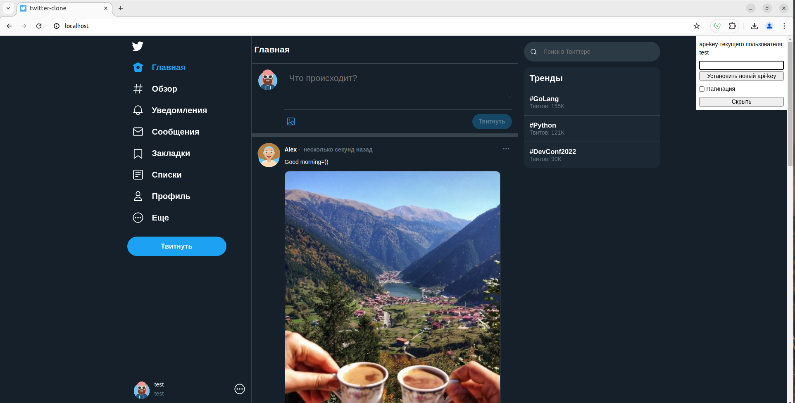

<h1 align="center">Junior Twitter Clone</h1>
<p align="center">

</p>

### Description  ###

This is social messenger is similar to former 'Twitter' with basic implemented 
functions. Where users can post, read and like twits of each other. 

### Functions ###

Any registered user can:
- Get a tweet feed sorted by the most popular tweets
- Post tweets with and without images
- Delete their own tweets
- Like and dislike tweets
- Follow and unfollow users
- View other users' profiles and their own profile

### Backend Features ###

The backend code is:
- Written on Python 3.10.12
- Using Docker Compose as a tool for running the application
- Using  FastAPI (async) framework as an ASGI application 
- Using NGINX as a reverse proxy server and Gunicorn with Uvicorn workers as a WSGI server
- Using database PostgreSQL for data storage and ORM SQLAlchemy for async connections and quires
- Covered and tested by Pytest
- Checked by linters such as mypy and wemake-python-styleguide(flake8 with different plugins) 
- Documented with Swagger in YAML format

### Getting started ###

This app is easy to start. Follow  the bellow requirements for Linux (Ubuntu): 

#### Installation
Ignore the following steps if you have already installed Docker Compose and Python 3.10.12.

1. Install docker engine and compose plugin for it.   
Follow steps from official site:  [Docker Engine Install](https://docs.docker.com/engine/install/ubuntu/) and [Docker Compose Install](https://docs.docker.com/compose/install/)

2. Install one of 
- Python 3.10.12 from official site:  [Python Downloads](https://www.python.org/downloads/)
- IDE PyCharm with Python 3.10.12 from official site: [PyCharm Installation Guide](https://www.jetbrains.com/help/pycharm/installation-guide.html#standalone)


#### Running the application:

- From the command line: 
```
cd 'your path to project root directory'
python main.py
```
- From IDE PyCharm
```
run main.py
```

You can also run linters by running 'run_linters.py' and pytests by running 'run_pytests.py'.

### Developers ###

Backend code was written by Sergey Solop.    
Contact email for suggestions and feedbacks: solop1992@mail.ru  
Frontend code was provided by Skillbox learning platform as a part of Python Course.  
Website: [Skillbox](https://skillbox.ru/)